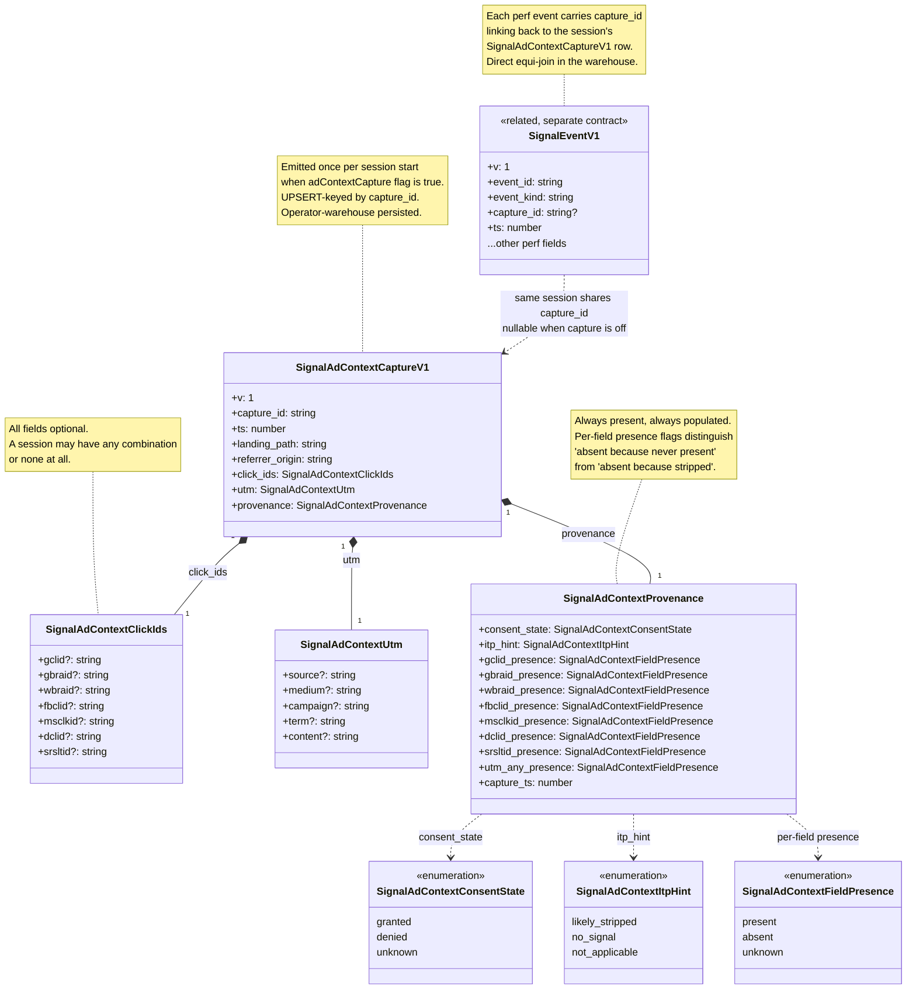

# Ad-context capture — class diagram (D4b)

_Last updated: 2026-05-13_

Schema-level visual of the public `SignalAdContextCaptureV1` contract and the types it composes. Source of truth for what shape ad-context capture rows take on the wire and in the operator's warehouse.

For the contract source see [`packages/signal-contracts/src/ad-context.ts`](../../packages/signal-contracts/src/ad-context.ts). For the operator-facing spec see [`docs/ad-context-capture.md`](../ad-context-capture.md). For the capture lifecycle sequence see [D3 sequence-ad-context-capture.md](./sequence-ad-context-capture.md).

---

## Diagram

---

## Type-level invariants

The class diagram captures structural shape. The semantic invariants enforced by `isSignalAdContextCaptureV1` in `packages/signal-contracts/src/ad-context.ts`:

1. **Version locked.** `v === 1`. Schema changes require a new versioned type (`SignalAdContextCaptureV2`), never an in-place change.
2. **`capture_id` non-empty.** UUID string; empty string fails validation.
3. **`ts` finite.** Numeric, finite. Non-finite (NaN, Infinity) fails validation.
4. **`landing_path` capped.** `<= SIGNAL_AD_CONTEXT_LANDING_PATH_MAX_LEN` (256 characters). Longer paths fail validation; runtime truncates head-plus-ellipsis before emission.
5. **`provenance` non-null.** Required field. Missing provenance block fails validation.
6. **Enum values valid.** `consent_state`, `itp_hint`, and every `*_presence` field must match the documented enum set. Invalid enum value fails validation.
7. **`click_ids` and `utm` are objects.** Even when empty, must be `{}`, not `null`. Validation rejects null.

Beyond the structural validation, the runtime layer (forthcoming alongside `packages/signal/src/ad-context/`) enforces field-level rules:

- Landing-path is pathname only — no query string, no fragment, no origin
- Referrer-origin is normalised origin only — no path, no query
- Captured fields not on this contract are silently dropped — no escape hatch for "raw URL" or "raw referrer"

---

## What this diagram does not show

- **Runtime emission logic** — when and how the SDK fires the capture. See [D3 sequence-ad-context-capture.md](./sequence-ad-context-capture.md).
- **Persistence path** — what happens between SDK emission and warehouse row. Operator-configured sink; out of scope.
- **Operator-side analytics** — what the operator does with the captured rows. Operator-defined; out of scope.
- **`SignalEventV1`'s full schema** — only the `capture_id` link is shown here. Full schema in `signal-technical-reference.md`.

---

## Drift detection

This diagram updates in the same PR as:

- A new field added to `SignalAdContextCaptureV1` or any composed type
- A new enum value (consent state, ITP hint, field presence)
- A change to the composition cardinality (currently 1:1 for click_ids, utm, provenance)
- A change to the `capture_id` relationship to `SignalEventV1`

A version bump (`v: 1` → `v: 2`) would create a new class `SignalAdContextCaptureV2` shown alongside V1; the V1 box would carry the `<<deprecated>>` stereotype.
