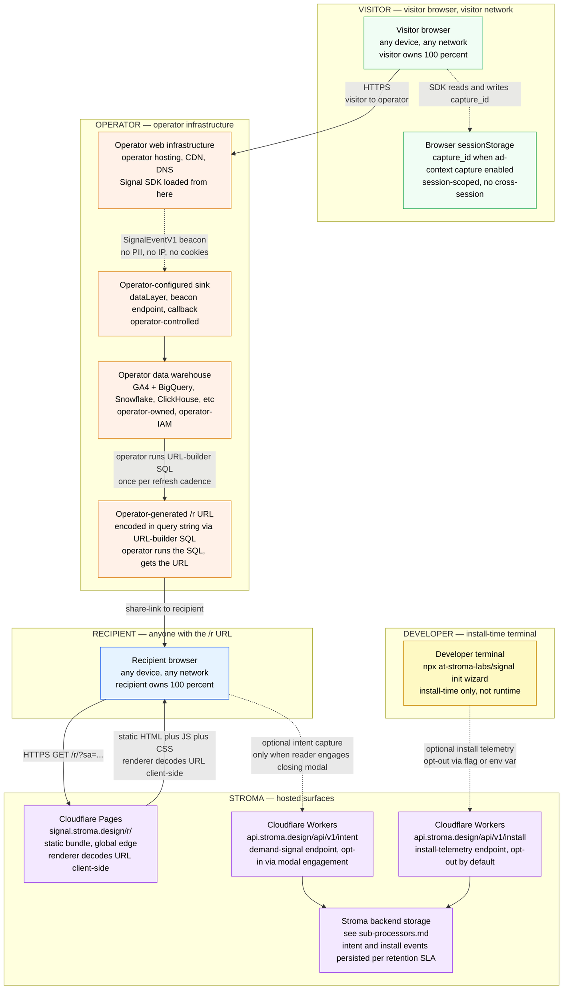

# Signal Core deployment — physical runtime view (D6b)

_Last updated: 2026-05-13_

Where each Signal Core surface physically runs, who controls each boundary, and what data crosses each hop. Companion to [`docs/data-flow-core.md`](../data-flow-core.md) (which shows the logical flow) — this view is procurement-/DPO-oriented and answers "whose infrastructure is this on?"

For the broader privacy posture see [`PRIVACY.md`](../../PRIVACY.md). For sub-processors specifically see [`docs/sub-processors.md`](../sub-processors.md).

---

## Diagram

---

## Trust-boundary matrix

| Boundary | Operator-controlled? | Stroma-controlled? | Visitor / Developer / Recipient-controlled? |
|---|---|---|---|
| Visitor's browser | No | No | Yes |
| Visitor's browser sessionStorage | No | No | Yes (browser sandbox) |
| Visitor's network | No | No | Yes |
| Developer's terminal (install time) | No | No | Yes (developer) |
| Operator's web infrastructure | Yes | No | No |
| Operator-configured sink | Yes | No | No |
| Operator's data warehouse | Yes | No | No |
| Stroma's Cloudflare Pages (`/r/` bundle) | No | Yes | No |
| Stroma's Cloudflare Workers (`/api/v1/intent`, `/api/v1/install`) | No | Yes | No |
| Stroma backend storage | No | Yes | No |
| Cloudflare global edge | No (Cloudflare-owned) | Stroma is a customer | No |
| Recipient's browser | No | No | Yes |

---

## Where each compute step runs

| Compute step | Physical runtime | Why it runs there |
|---|---|---|
| Performance event capture | Visitor browser | The only place performance measurements exist. |
| Ad-context capture (opt-in) | Visitor browser | The only place URL params, referrer, consent state are observable at capture time. |
| `capture_id` generation + persistence | Visitor browser + sessionStorage | Session-scoped identifier; sessionStorage is the only API that gives session-scoped persistence without a cookie. |
| Beacon / sink delivery | Visitor browser → operator's sink | Operator's existing ingest path (existing SDK contract). |
| Warehouse persistence | Operator's data warehouse | Operator-owned compute, operator-owned data. Stroma not involved. |
| URL-builder SQL execution | Operator's data warehouse | Operator runs the SQL; Stroma not involved. |
| `/r` Tier Report static delivery | Cloudflare Pages, global edge | Standard static-bundle CDN. |
| `/r` decoding + rendering | Recipient's browser | URL query-string decoded client-side; render is fully client-side. Cloudflare logs see the URL request; Stroma does not parse or persist the encoded report payload. |
| Intent capture (opt-in via modal engagement) | Cloudflare Workers + Stroma backend storage | Stroma-side endpoint; per-event POST via `sendBeacon`. |
| Install telemetry (opt-out by default) | Cloudflare Workers + Stroma backend storage | Stroma-side endpoint; CLI POSTs install-lifecycle events. Multiple opt-out mechanisms. |

---

## What Stroma receives (and when)

Three explicit, separately-disclosed surfaces. None of them receive performance event data from the SDK by default.

1. **`signal.stroma.design/r/` (static bundle delivery)** — Cloudflare logs see the URL request. Stroma does not parse, persist, or analyse the encoded report payload beyond standard CDN access-log retention.
2. **`api.stroma.design/api/v1/intent`** — Receives intent events ONLY when a recipient engages the report's closing modal. Documented in [`PRIVACY.md`](../../PRIVACY.md) §"What Stroma receives".
3. **`api.stroma.design/api/v1/install`** — Receives install-lifecycle events from the CLI wizard. Opt-out via `--no-telemetry`, `STROMA_TELEMETRY=0`, `DO_NOT_TRACK=1`, or CI / non-TTY environments (auto-disabled silently).

Retention windows for each surface: see [`docs/data-retention-sla.md`](../data-retention-sla.md).

---

## Data residency

The only Stroma-controlled hops that carry operator-side or visitor-side data are the optional Stroma-hosted endpoints (intent + install). Performance events captured by the SDK never reach Stroma — they go to the operator-configured sink. Static-bundle delivery from Cloudflare Pages carries no per-operator data.

The architectural realisation: a procurement reviewer concerned about data residency for Signal Core reads this diagram and sees:
- Operator-controlled SDK ingestion, operator-controlled warehouse, operator-controlled URL generation
- Stroma-controlled static bundle (no operator data)
- Stroma-controlled optional endpoints (opt-in / opt-out, narrow per-event payloads, documented retention)

---

## Drift detection

This diagram updates in the same PR as:

- A new Stroma-hosted endpoint
- A change to which endpoints persist data (currently: intent, install)
- A change to the opt-in / opt-out posture of any endpoint
- A change to the sub-processors list that touches a runtime hop
- A new operator-controlled component in the data flow

The architectural invariant this diagram protects: **performance event data captured by the SDK does not reach Stroma**. Any change that would introduce such an arrow requires explicit privacy-posture revision in [`PRIVACY.md`](../../PRIVACY.md) and the matching ADR.
