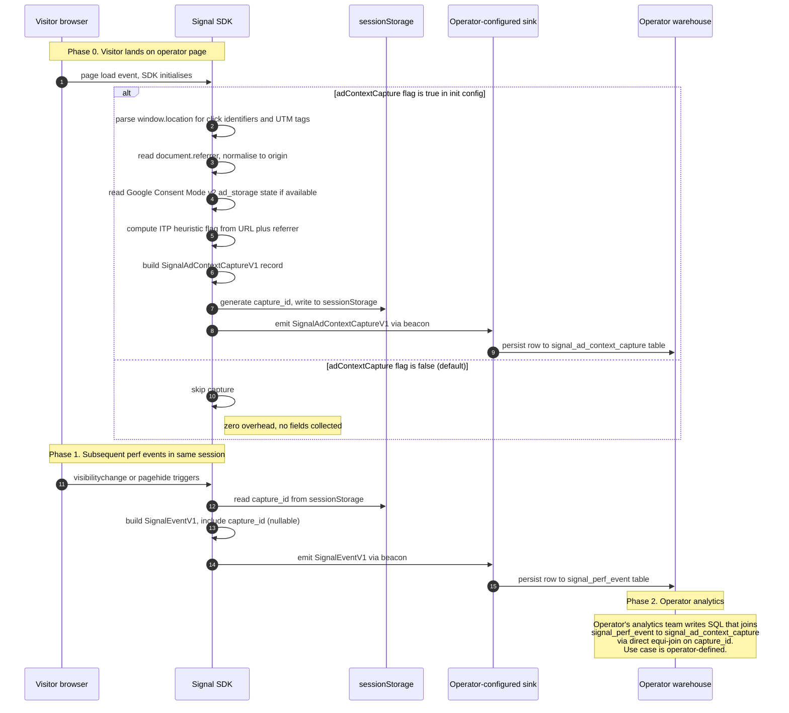

# Ad-context capture — sequence diagram (D3)

_Last updated: 2026-05-13_

End-to-end sequence for the opt-in ad-context capture module shipped in `@stroma-labs/signal-contracts` and (forthcoming) `@stroma-labs/signal`. Shows visitor browser through to operator-warehouse persistence.

For the canonical capture contract see [`docs/ad-context-capture.md`](../ad-context-capture.md). For the broader Signal Core data flow see [`docs/data-flow-core.md`](../data-flow-core.md).

---

## Diagram

---

## What each step carries

### Phase 0 — session start, optional capture

The SDK initialises with `adContextCapture: true` (off by default). On the first event of a session, the SDK:

- Parses `window.location.search` for known click identifiers: `gclid`, `gbraid`, `wbraid`, `fbclid`, `msclkid`, `dclid`, `srsltid`
- Parses for UTM tags: `utm_source`, `utm_medium`, `utm_campaign`, `utm_term`, `utm_content`
- Reads `document.referrer` and normalises to origin (no full path, no query string)
- Reads Google Consent Mode v2 `ad_storage` state if the operator has consent-mode wired
- Computes the ITP heuristic flag (`likely_stripped` when no click identifier was captured AND the referrer is a recognised ad-network origin)
- Generates a UUID `capture_id` and writes it to `sessionStorage`
- Emits a single `SignalAdContextCaptureV1` record via the operator-configured beacon sink

When the feature flag is `false` (the default), none of this runs. Zero overhead.

### Phase 1 — subsequent events

Every subsequent `SignalEventV1` in the same session reads `capture_id` from `sessionStorage` and includes it in the payload. The field is `null` when ad-context capture is disabled.

### Phase 2 — operator-side analytics

The operator's analytics team writes SQL that joins their performance event table to their ad-context capture table via direct equi-join on `capture_id`. Use case is operator-defined — could be paid-traffic attribution, cohort-aware performance analysis, internal funnel reporting, or any other purpose the operator's analytics team chooses.

---

## Boundaries

- **No Stroma-controlled sink.** The SDK delivers to the operator's configured sink (`dataLayer`, beacon endpoint, or callback). Stroma does not receive ad-context capture data via this flow.
- **Session-scoped storage.** `sessionStorage` is wiped when the browser tab/window closes. No cross-session correlation, no cookie, no `localStorage`, no identity graph.
- **Capture-time only.** All capture happens at page-load and on natural lifecycle events. No DOM mutation observation, no interaction tracking specific to this module.
- **Opt-in default off.** Operators must explicitly enable `adContextCapture: true`. Existing installs pay no cost unless they enable it.

---

## What's not shown

- **The optional `signal.track()` milestone API.** When operators run SPA funnels and want per-route capture beyond natural document-load events, they can call `signal.track({ milestone })` to fire a milestone-tagged `SignalEventV1`. Documented separately in `docs/custom-milestones.md` _(forthcoming alongside the runtime ship)_.
- **The receiving sink's downstream behaviour.** Whatever happens after the operator's sink receives the event is operator-controlled — out of scope for this diagram.

---

## Drift detection

This diagram updates in the same PR as:

- A new captured field on `SignalAdContextCaptureV1`
- A change to the `capture_id` persistence model (`sessionStorage` → something else)
- A new emission trigger (currently: page load, visibilitychange, pagehide, milestone)
- A change to the opt-in default (currently: off)
