# Data Flow — Signal Core

_Last updated: 2026-05-12_

This document shows where data captured by the Signal SDK and the optional Stroma-hosted endpoints travels, and what is and is not retained at each hop. It exists to give a procurement / DPO reviewer a one-page mental model of the system's actual data flow without requiring source-code archaeology.

For the broader privacy posture, see [`PRIVACY.md`](../PRIVACY.md). For retention windows, see [`data-retention-sla.md`](./data-retention-sla.md).

---

## High-level flow

```mermaid
flowchart LR
    Browser["Visitor's Browser<br>Signal SDK runs here"]
    CLI["Developer's Terminal<br>signal init wizard"]

    OpSink["Operator-configured sink<br>dataLayer or beacon or callback"]
    OpWarehouse[("Operator's Warehouse<br>GA4 or BigQuery or Snowflake or other")]
    OpReport["Operator opens or shares<br>signal.stroma.design/r/ URL"]

    StromaEdge{{"Cloudflare Edge<br>signal.stroma.design<br>api.stroma.design"}}
    StromaR["Static /r renderer<br>Cloudflare Pages"]
    StromaIntent[("api.stroma.design<br>/api/v1/intent")]
    StromaInstall[("api.stroma.design<br>/api/v1/install")]
    StromaBackend[("Stroma backend storage<br>see sub-processors.md")]

    Recipient["Anyone with the report URL<br>opens it in a browser"]

    Browser -- "SignalEventV1 payload, no PII, no IP, no cookies" --> OpSink
    OpSink --> OpWarehouse

    OpWarehouse -- "Operator runs URL-builder SQL on refresh cadence" --> OpReport
    OpReport -- "GET signal.stroma.design/r/ with sa query string" --> StromaEdge
    StromaEdge --> StromaR
    StromaR -- "Static HTML plus JS plus CSS, zero Stroma-side state" --> Recipient
    Recipient -- "Decodes sa client-side, renders report locally" --> Recipient

    Recipient -- "Reader picks a modal option plus optional email" --> StromaIntent
    StromaIntent --> StromaBackend

    CLI -- "Install lifecycle events: framework, version, outcome only" --> StromaInstall
    StromaInstall --> StromaBackend

    CLI -. "no-telemetry flag, STROMA_TELEMETRY env, DO_NOT_TRACK env, or CI auto-disable" .-> CLI

    classDef stroma fill:#fff1e8,stroke:#d97706,stroke-width:1px,color:#000;
    classDef operator fill:#e6f3ff,stroke:#2563eb,stroke-width:1px,color:#000;
    classDef visitor fill:#f0fdf4,stroke:#16a34a,stroke-width:1px,color:#000;
    class StromaEdge,StromaR,StromaIntent,StromaInstall,StromaBackend stroma
    class OpSink,OpWarehouse,OpReport operator
    class Browser,CLI,Recipient visitor
```

---

## What each hop carries (and does not carry)

### 1. Visitor's browser → operator-configured sink

The Signal SDK fires `SignalEventV1` per real document navigation. The payload is the schema documented in [`signal-technical-reference.md`](./signal-technical-reference.md).

**Stroma is not involved in this hop.** The SDK has no Stroma-controlled default sink. Default behaviour is operator-controlled.

What's on the wire:
- Performance vitals (LCP, FCP, INP, CLS, TTFB)
- Navigation-timing breakdown
- Coarse device + connection signals
- Browser family bucket
- Host + path (no query string)
- Per-event UUID + timestamp

What's NOT on the wire:
- IP (the SDK doesn't capture it; the operator's sink may or may not log the request IP — that's operator-controlled)
- Cookies, user IDs, emails, full UA strings
- Document title, page content, form inputs, query strings

### 2. Operator's warehouse → operator-rendered report URL → Stroma's edge

When the operator wants a hosted report, they run the URL-builder SQL (`docs/ga4-bigquery-url-builder.sql` or `docs/normalized-bigquery-url-builder.sql`) against their own warehouse. The query encodes the aggregated report into a URL like `signal.stroma.design/r/?sa=<base64>`.

When the operator (or anyone they share the URL with) opens that URL, the browser GETs it from `signal.stroma.design`. The static bundle at `/r/` decodes the query string client-side and renders the report locally. **No raw event data leaves the operator's warehouse on this hop** — only the pre-aggregated, URL-encoded payload.

Stroma's edge logs the URL request per standard Cloudflare CDN logging. Stroma does not parse the encoded report payload or extract value from access logs beyond standard CDN debugging.

### 3. Optional intent capture (only when a reader engages the closing modal)

The `/r` report has a closing modal with four customer-lens choices. If a reader picks one, the report's client-side code POSTs a small intent payload to `api.stroma.design/api/v1/intent` via `sendBeacon`. This is the only point at which Stroma receives any data from a report viewer, and only when the viewer voluntarily engages the modal.

What's POSTed:
- Event kind (which lens was selected)
- Capture id (per-modal-session UUID)
- Optional email (only if the reader typed one)
- Optional cadence / pill_id / freeform text (depending on lens)
- Server-side: user-agent string (for product research) + Cloudflare-edge IP (for rate-limiting, not stored)

Retention: see [`data-retention-sla.md`](./data-retention-sla.md).

### 4. Install telemetry (opt-out, from the CLI)

When a developer runs `npx @stroma-labs/signal init`, the CLI sends anonymous install-lifecycle events to `api.stroma.design/api/v1/install`. Off-switches: `--no-telemetry`, `STROMA_TELEMETRY=0`, `DO_NOT_TRACK=1`, and auto-disabled in CI / non-TTY environments. A first-run disclosure surfaces the behaviour before any data is sent.

What's captured: framework + version, sink choice, sample rate, package manager, Node version, OS family, CLI version, outcome.

What's NEVER captured: project name, file paths, file contents, free text, emails, hostnames, full user-agent string.

---

## Boundaries the diagram enforces

- **Performance events never reach Stroma via the SDK.** The arrow from `Browser` goes only to `OpSink`. There is no edge from the SDK to any Stroma-controlled surface for performance data.
- **`/r` rendering is static + client-side.** The arrow from `StromaR` to `Recipient` is "Static HTML + JS + CSS." Nothing else flows back to Stroma during rendering. The recipient decodes and renders locally.
- **Intent and install endpoints are explicit, separately-disclosed surfaces.** Each has its own retention SLA, its own opt-out (intent is engagement-gated; install has multiple environment + flag opt-outs), and its own purpose documented in [`PRIVACY.md`](../PRIVACY.md).

---

## When this diagram changes

Material changes to the data flow (new Stroma-side surface, new operator-side default behaviour, removal of an existing path) will:

1. Update this diagram in the same commit as the architectural change.
2. Land in the project [`CHANGELOG.md`](../CHANGELOG.md).
3. Surface in the next SDK release notes when the change affects operator-visible behaviour.

This diagram is the canonical reference. If the code's actual data flow ever drifts from what's shown here, the diagram (not the code) is the bug.
